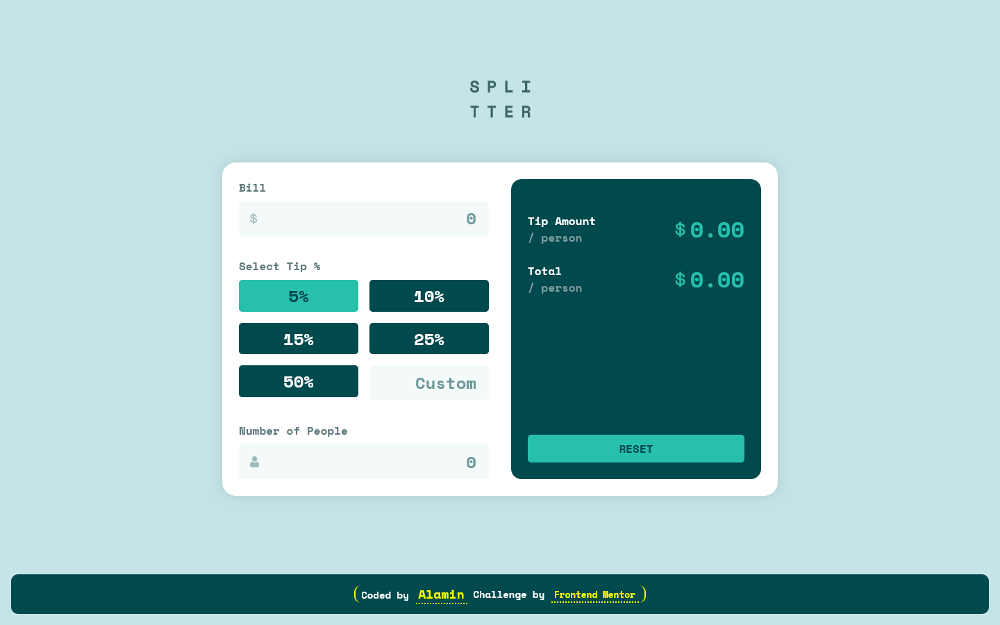

# Tip-calculator-app
Building a tip-calculator-app to practice JS

This app will help you calculate the tip that you should add depending on how many percents you want to give away.
This is the reference picture of the project.

My goal is to make the app look good, functional and responsive.